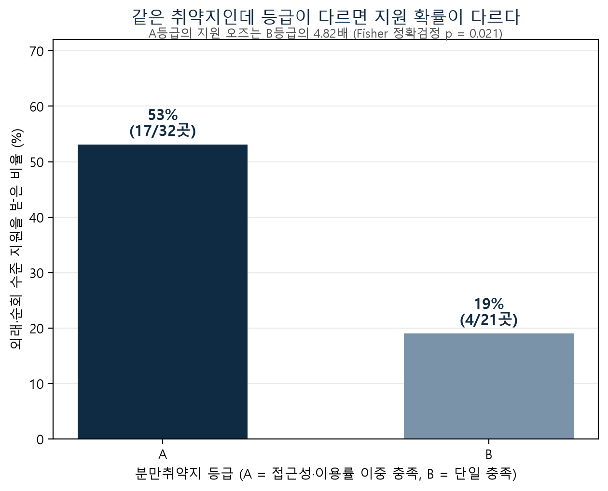
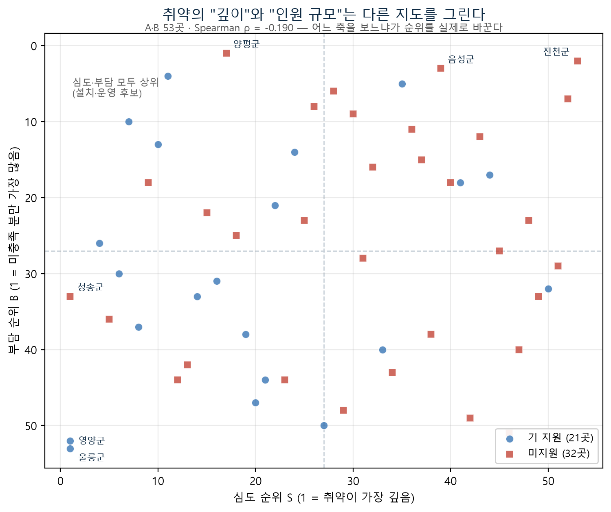
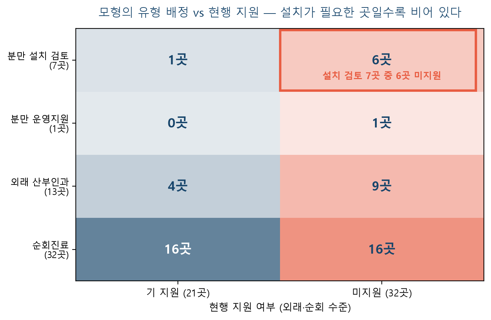
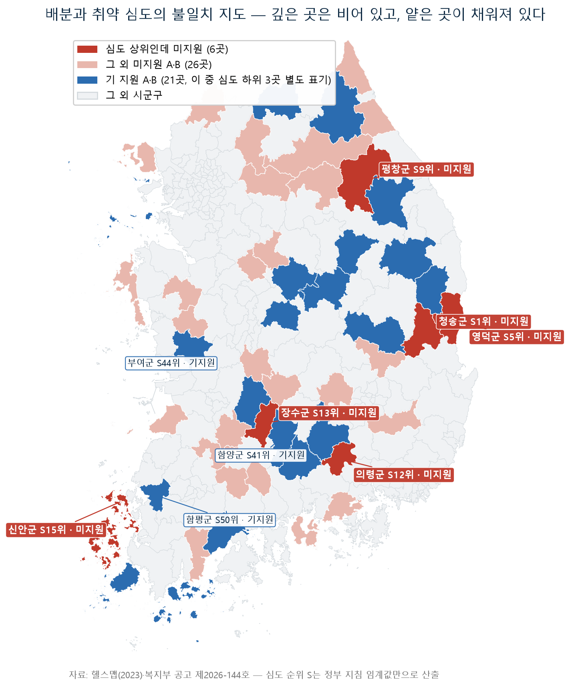

# 측정과 배분 사이
## — 분만취약지 제도의 전 과정 데이터 감사와 우선순위 모형

**2026 제5회 명지대학교 창의적 SW프로그램 경진대회 · 빅데이터 분석 부문**
결과보고서 v2 통합본 (2026-08-10, 그림 4종·용어 해설 반영) — A안(지정 감사) + 조원안(배분 진단·처방) 결합.
모든 수치는 `분만취약지_최종분석.ipynb`와 `03_분석/` 스크립트로 재현 가능하며,
독립 재실행 검증을 완료했다(부록 A).

---

## 연구 요약 (한 페이지)

| | |
|---|---|
| **한 줄 테제** | 정부는 분만취약지를 정밀하게 측정한다. 그러나 **지정 규칙은 이동시간만 보고, 배분은 그 측정값조차 따르지 않는다.** 본 연구는 그 두 개의 공백을 정부 자신의 데이터와 기준으로 메운다. |
| **대상 제도** | 의료취약지 지정(공공보건의료법 제12조) + 분만취약지 지원사업(A·B·C 등급 108곳, 15년 누적 57개소 지원) |
| **데이터** | 헬스맵 공공 데이터셋 9종(2023, 226만 행) + 복지부 공고 제2026-144호 + 「분만취약지 지원사업 안내」(343p) — 전량 공개 자료 |
| **발견 1 (지정)** | 공표된 판정식(접근성·TRI)이 실제 지정을 **158/159(99.4%) 재현** — 판정은 이동시간 파생 지표만으로 작동하며, 공급 변수를 추가해도 판별력이 전혀 늘지 않음(AUC 무변화, §5.2) |
| **발견 2 (지정)** | 거리 기준은 통과하지만 관내 공급이 소멸한 **공급 공백형 사각지대** 실재 — 분만 5곳은 등급 체계(A/B/C) 어디에도 없고, 소아과는 5개 지역 입원 5,689건 전량(100%)이 관외 유출 |
| **발견 3 (배분)** | 실질 취약지 A·B 53곳 중 21곳만 기지원. A등급이 지원받을 오즈(못 받을 확률 대비 받을 확률)는 B등급의 **4.82배**(Fisher p=0.021) — 그러나 그 21곳 선정은 접근성 축 외에는 공개 지표로 설명되지 않음(모형 설명력 16% 수준 — McFadden R² 0.163, §6.3). **배분 규칙이 데이터 바깥에 있다** |
| **발견 4 (배분)** | 현행 배분은 취약의 **깊이(심도)** 와는 정렬(ρ=+0.381)되지만 **인원 규모(부담)** 와는 무관(ρ=−0.131). 두 관점의 순위 상관은 **−0.190** — 어느 축을 보느냐가 결과를 실제로 바꾼다 |
| **제안** | ① 지정: 공급 공백형(유형 II) 트랙 신설 ② 지표: TRI 관내/관외 병기 ③ 배분: 우선순위에 부담 축 병기 ④ B등급 이용률 공백형 별도 관리 ⑤ 시·도 선별용 표준 우선순위표 제공(산출물 `최종_우선순위표.csv`가 곧 부록) |

**논증의 흐름** — 각 장은 앞 장이 답한 것 위에서만 다음을 묻는다.

| | 장 | 묻는 것 | 답이 열어 주는 다음 질문 |
|---|---|---|---|
| **발단** | §1 | 자원 부족은 실재한다. 그런데 **배분의 문제**도 함께 있는 것 아닌가? | 배분을 담당하는 **제도**가 이미 있다 → 그 제도는 작동하는가? |
| **독해** | §2~3 | 제도가 스스로 정한 규칙과 숫자는 정확히 무엇인가? | 규칙을 알았으니 → 실제로 그대로 작동하는지 검산할 수 있다 |
| **확인** | §4 | 의심하는 현상이 데이터에 보이기는 하는가? | 보인다 → 통계로 검정할 가치가 있다 |
| **감사 I** | §5 | 지정은 규칙대로 작동하는가, 그 규칙은 무엇을 놓치는가? | 지정은 정확하다 → 그럼 공백은 **다음 단계**에 있는가? |
| **감사 II** | §6 | 정확히 지정해 놓고, 그대로 나눠 주고 있는가? | 나눠 주는 규칙이 없다 → 그 빈칸을 채울 수 있는가? |
| **처방** | §7 | 정부 자신의 기준만으로 순서 규칙을 만들면 현행과 어디가 어긋나는가? | 어긋나는 명단이 나온다 → 무엇을 제안할 것인가 |
| **귀결** | §8~10 | 제언·한계·결론 | 발단의 가설로 돌아가 답한다 |

---

## 1. 서론

### 1.1. 발단 — 자원이 부족한 것은 맞다. 그런데 그것만으로 설명되는가

지방의 의료 공백은 익숙한 뉴스다. 분만실이 없어 두세 시간을 달려 아이를 낳았다는 기사는 해마다 반복된다.
그리고 그때마다 따라붙는 처방도 늘 같다. **의사를 늘리고, 병원을 지어라.**

**이 처방은 옳다.** 분만 인프라의 절대량이 모자란 것은 사실이고, 확충은 반드시 필요하다.
본 연구는 그 사실을 부정하지 않는다.

다만 그것이 **유일한 원인인지는 별개의 문제**다. 자원이 모자란 것과, 있는 자원이 필요한 곳으로
**체계적으로 배분되지 않는 것**은 서로 다른 문제이며, 둘은 동시에 성립할 수 있다.
그리고 이 두 문제는 **해법이 다르다.**

| | 문제 | 해법 | 데이터가 답할 수 있는가 |
|---|---|---|---|
| ㉠ | 자원의 절대량이 모자라다 | 예산 증액·인력 양성 | ✗ — 정책·재정의 영역 |
| ㉡ | 있는 자원이 체계적으로 배분되지 않는다 | 배분 규칙의 설계 | **✓ — 규칙과 데이터의 문제** |

㉠은 이미 널리 지적되어 왔고 지금도 논의 중이다. 반면 ㉡은 **아직 전국 단위 데이터로 검증된 적이 없다.**
본 연구가 ㉡을 맡는 이유는 ㉠이 틀려서가 아니라, ㉡이 비어 있기 때문이다.
그리고 ㉡에서 개선의 여지가 확인된다면 그만큼은 **예산을 늘리지 않고도 줄일 수 있는 공백**이 된다.

그래서 본 연구가 묻는 것은 "얼마나 부족한가"가 아니라
**"지금 있는 것은 체계적으로, 필요한 곳으로 배분되고 있는가"** 다.

### 1.2. 확인 — 자원을 공백 지역으로 보내는 제도는 이미 존재한다

그리고 그 통로는 이미 깔려 있다. 정부는 **분만취약지 지원사업**을 15년째 운영해 왔다.

여기서 말하는 **분만취약지**는 소득이나 인구가 적은 지역이 아니라, **분만실까지의 이동시간**을
기준으로 정의되는 지역이다. 구체적으로는 그 지역 가임기 여성이
① 분만이 가능한 의료기관까지 **60분 안에 닿기 어렵고**(접근성),
② 실제 출산에서도 **60분 안에 분만한 비율이 낮은**(이용률) 시·군을 말한다.
즉 이 제도에서 "취약"은 처음부터 끝까지 **거리와 시간의 문제로 정의**되어 있다 — 이 점이 뒤에서
본 연구의 첫 번째 표적이 된다.

정부는 2년마다 전국 시·군·구를 이 기준으로 재어 등급(A·B·C)을 매기고, 지정된 지역의 병원에
분만실 설치비(약 10억 원)와 연간 운영비(약 5억 원)를 지원한다. 15년간 누적 57개소가 지원받았다.

통로가 이미 있다는 사실은 질문을 다음 단계로 옮긴다. **이 통로는 제대로 작동하고 있는가?**

### 1.3. 왜 '제도 그 자체'를 분석 대상으로 삼는가

제도는 자원을 세 단계에 걸쳐 흘려보낸다 — **측정 → 지정 → 배분**.

| 단계 | 하는 일 | 구체적으로 |
|---|---|---|
| ① 측정 | 재는 단계 | 2년마다 전국 시·군·구의 **분만실까지의 접근성**과 **실제 분만의 이동시간**을 산출 |
| ② 지정 | 판정하는 단계 | 그 측정값을 정해진 임계값과 대조해 분만취약지를 판정하고 A·B·C 등급 부여 |
| ③ 배분 | 자원을 주는 단계 | 지정 지역의 병원 중 한 곳을 골라 설치비·운영비를 지급 |

단계가 셋이라는 것은 곧, **어느 한 단계에서 막히거나 새면 앞 단계가 아무리 정확해도 자원이 엉뚱한
곳으로 간다**는 뜻이다. 측정이 아무리 정밀해도 지정 규칙이 그 값을 다 쓰지 않으면 정밀도는 버려진다.
지정이 정확해도 배분에 순서 규칙이 없으면 누가 먼저 받을지는 임의가 된다.

그래서 본 연구의 분석 대상은 취약지라는 **현상**이 아니라, 취약지를 판정하고 지원하는 **제도 그 자체**다.
현상 분석은 "어디가 취약한가"를 답한다. 제도 감사는 **"왜 그곳이 아직 취약한 채로 남아 있는가"** 를 답한다.
전자는 이미 정부가 하고 있고, 후자는 아직 아무도 데이터로 하지 않았다.

### 1.4. 두 개의 의심

제도 문서를 먼저 읽고 나서, 우리는 각 단계에 하나씩 의심을 걸었다.

- **지정 단계**: 판정 기준은 이동시간 파생 지표뿐이다. "60분 안에 (타 지역으로) 갈 수 있는" 지역은
  관내 공급이 소멸해도 취약지가 아니다. — *기준이 놓치는 지역이 있지 않은가?*
- **배분 단계**: 실질 취약지 53곳 중 21곳만 지원받았다. 지원 심사 배점 100점에 취약도 항목은 0점이고,
  시·도 선별 기준은 "예산 규모, 의료 취약성 등 고려"가 전부다. — *누구를 먼저 지원할지의 규칙이 있는가?*

이 의심들은 언론·국회에서 반복 제기됐지만 전국 단위 데이터로 정량 검증된 적이 없다. 본 연구가 그 빈칸을 채운다.

### 1.5. 연구 질문 — 그리고 각 질문이 답해 주는 것

의심을 검증 가능한 형태로 옮기면 네 개의 질문이 된다. 각 질문은 파이프라인의 한 지점을 겨냥한다.

[표 1] 연구 질문 4개와 각 질문의 의의

| # | 질문 | 겨냥하는 지점 | 답을 얻으면 알게 되는 것 |
|---|---|---|---|
| **RQ1** | 현행 지정은 공표된 판정식대로 작동하는가? 공급은 반영되는가? | 측정 → 지정 | 판정이 **무엇을 보고 무엇을 보지 않는지**가 확정된다. 이후 모든 비판의 사실적 근거 |
| **RQ2** | 판정식이 구조적으로 놓치는 지역이 실재하는가? | 지정의 사각 | 규칙의 한계가 **추상적 우려인지 실재하는 명단인지**가 갈린다 |
| **RQ3** | 지정 이후의 지원 배분은 무엇으로 설명되는가? | 지정 → 배분 | 배분이 **공개 규칙을 따르는지, 규칙 밖에서 정해지는지**가 드러난다 |
| **RQ4** | 정부가 이미 정한 기준만으로 배분 규칙을 만들면 현행과 어디가 어긋나는가? | 배분의 처방 | 비판이 **대안으로 전환**된다. 어긋나는 지점이 곧 개선 대상 명단 |

RQ1·2는 **지정 감사**, RQ3·4는 **배분 감사와 처방**으로 묶인다. 앞의 둘이 "규칙이 무엇을 보는가"를
확정해야, 뒤의 둘에서 "그 규칙대로 나눠지고 있는가"를 물을 수 있다 — 순서 자체가 파이프라인을 따른다.

### 1.6. 이 연구가 스스로 지키는 원칙 — 예산 증액은 본 연구의 결론이 될 수 없다

§1.1에서 나눈 두 문제 중 본 연구가 맡은 것은 ㉡(배분)이다.
㉠(절대량 부족)은 실재하지만 데이터로 답할 수 없는 영역이므로,
**결론이 "예산을 늘려라"로 수렴하면 이 연구는 자기가 맡은 몫을 답하지 않은 것이 된다.**
취약지는 많은데 지원이 적다는 지적은 그 자체로 타당하지만, 분석의 산출물은 아니다.

그러므로 본 연구의 제안은 전부 **"같은 예산을 명시적 규칙으로 다르게 나누라"** 로 한정하고,
근거 수치와 임계값은 모두 정부 자신의 문서·데이터에서 가져온다.
이것이 두 가지를 동시에 지킨다 — **실현 가능성**(추가 재원이 필요 없다)과
**역할의 명료함**(예산 논의를 대신하지 않고, 그 논의와 무관하게 지금 개선 가능한 몫만 특정한다).

---

## 2. 제도와 이론

**이 장의 의의**: 제도를 감사하려면 먼저 제도가 스스로 정한 규칙을 정확히 알아야 한다.
임계값 하나, 등급 정의 한 줄을 잘못 읽으면 이후의 모든 검증이 무효가 되기 때문이다.
그래서 이 장은 분석이 아니라 **독해**다 — 고시·공고·지침 343쪽에서 판정 지표의 정의,
등급의 의미, 배분 절차를 원문 그대로 확정한다. 여기서 확정한 숫자들(30/30, 연 50건, 36,588명)이
§5의 검산 기준이 되고, §7에서는 우리가 만들 모형의 유일한 재료가 된다.
**본 연구가 새로 만든 기준은 하나도 없다**는 방어선이 이 장에서 세워진다.

### 2.1. 판정 지표 두 개 — 정확한 정의

[표 2] 분만취약지 판정 지표 두 개의 정의와 성격

| 지표 | 정의 | 성격 |
|---|---|---|
| **접근성취약인구비율** | 60분 내 분만 가능 기관(연 50건 이상 수행)에 **도달 불가능한** 가임인구 비율. GIS·100m 인구격자로 계산한 **이론값** | 이동시간 파생 |
| **TRI (기준시간내 의료이용률)** | 주민의 실제 분만 중 **거주지에서 이동시간 60분 내** 기관에서 이뤄진 비율. 건보 청구 DB 기반 **행태 실측값** | 이동시간 파생 |

TRI에 관한 흔한 오해 세 가지를 정리한다. ① 병원 내 대기시간과 무관하다 — 오직 거주지→기관 이동시간이다.
② "60분 초과 비율"이 아니라 "60분 **이내** 이용 비율"이다 — 높을수록 양호, 30% 미만이면 취약.
③ **관내/관외를 구분하지 않는다** — 옆 도시 병원이라도 60분 안이면 "이용됨"으로 집계된다.
③이 본 연구 지정 감사(§5)의 핵심 열쇠다.

두 지표를 동시에 쓰는 이유는 상호 보완이다. 접근성만 보면 지도 계산 오차로 오판하고,
TRI만 보면 "갈 수 있는데 대형병원을 선호해 안 간 것"과 "못 간 것"이 구분되지 않는다.
**둘 다 나쁠 때만 취약**으로 보는 이중검증 설계다.

### 2.2. A·B·C 등급 — 취약도 서열이 아니라 자격표

[표 3] A·B·C 등급의 정의와 신청 가능 사업 (전국 108곳)

| 등급 | 정의 | 곳수 | 신청 가능 사업 |
|---|---|---:|---|
| A | 접근성취약 ≥30% **AND** TRI <30% | 32 | 설치·운영, 운영지원, 외래, 순회 |
| B | 두 기준 중 하나만 충족 | 21 | A와 동일 |
| C | 30/30 미충족이나 ① 분만실 운영을 위한 배경인구(36,588명) 미달 또는 ② 분만 지원 기수령 | 55 | 운영지원, 외래, 순회 (설치 제외) |

C는 이질적 잔여 범주다: "원래 규모가 안 되는 곳"과 "지원 성공으로 졸업한 곳"이 섞여 있다.
특히 **분만 지원을 받으면 C로 이동**하므로, C의 높은 기지원율(65.5%)은 취약도가 아니라 정의의 결과다.
이 구조가 §6의 분석 설계(C 제외)를 강제한다.

**단, 등급을 옮기는 것은 분만 지원(설치·운영)뿐이다.** 외래 산부인과·순회진료는 산전진찰이나 방문 진료에
그치는 완화책이어서 분만 공백을 해소하지 못하므로, 이를 받아도 A·B 등급은 그대로 유지된다.
그래서 A·B 안에도 기지원 지역이 존재한다 — 15년 누적 57개소를 유형별로 보면 분만 36곳은 전원 C로 이동했고,
**외래 15 + 순회 6 = 21곳이 A·B에 남아 있다**(A 17 + B 4와 정확히 일치, §4.3).
즉 A·B의 기지원이란 "완화책만 받았을 뿐 관내 분만은 여전히 불가능한 상태"를 뜻한다.

### 2.3. 지역으로 재고, 병원으로 준다 — 배분의 4단계 관문

등급은 시·군에 붙지만(지자체 신청·이의 없이 자동 통보), 지원은 병원 단위로 흐른다:
**① 병원의 자발적 신청 → ② 시·군 공개경쟁 1곳 선정 → ③ 시·도 선별(원칙 1개소, 기준 사실상 재량)
→ ④ 복지부 심사(100점 = 정량 20 + 정성 80, 취약도 항목 0점)**.
즉 심사는 "얼마나 급한가"가 아니라 "얼마나 해낼 수 있는가"를 본다. 병원이 손들지 않는 지역은
등급이 있어도 아무 일도 일어나지 않으며, 15년 누적 지원은 57개소(분만 36·외래 15·순회 6),
2025년 신규는 전국 1개소다. 즉 실제 제약은 "한 지역에 몇 개를 지원하느냐"가 아니라
**"전국에서 한 해에 몇 곳을 새로 지원할 수 있느냐"**다. 자격을 갖춘 53곳 앞에 문이 한 해에 하나씩 열리는 셈이므로,
관건은 자연히 **"올해 누구 차례인가"**가 된다. 그런데 그 순서를 정하는 규칙이 제도 어디에도 없다.

### 2.4. 이론 프레임과 차별점

보건지리학 표준(2SFCA — 거리와 공급량을 함께 반영해 접근성을 재는 대표 기법)은 접근성을
**공간적(거리·시간)** 축과 **비공간적(공급·수용력)** 축의 결합으로 본다.
현행 지정은 전자만 계측한다(§5에서 입증). 선행 논의 대비 본 연구의 차별점:

[표 4] 선행 논의 대비 본 연구의 차별점

| 기존 | 본 연구 |
|---|---|
| "취약지가 어디인가"를 찾는 분석 | **"판정·배분 기준이 무엇을 놓치는가"** — 제도 자체의 감사 |
| 집계 수준 문제 제기 | 지정 규칙을 그대로 재계산해 대조하는 검증(99.4%) + 배분의 통계 진단 + 사각지대의 다중 증거 |
| 추상적 제언 | 정부 임계값만으로 구성한 **재지정·우선순위 시뮬레이션**과 표 산출물, 실패 설계(보상형 지수·군집)의 공개 |

## 3. 데이터 및 전처리

**이 장의 의의**: 제도를 감사하는 연구는 감사받는 쪽이 반박할 수 없는 자료 위에 서야 한다.
그래서 원천을 **정부가 직접 만들어 공개한 데이터로 한정**했다 — 로그인이나 승인이 필요한 자료,
재현 불가능한 가공 자료는 처음부터 배제했다. 심사자든 공무원이든 같은 파일을 받아 같은 결과를
재현할 수 있어야 이 연구의 결론이 의견이 아니라 사실이 된다.
다만 공개 데이터에는 정부도 문서화하지 않은 함정이 있었고(§3.3), 판정에 필요한 "공급" 변수는
아예 제공되지 않아 직접 만들어야 했다(§3.2). 이 장은 그 재료 손질의 기록이다.

### 3.1. 데이터 명세 — 단일 공개 원천 + 정부 문서

[표 5] 데이터 원천과 추출 항목

| 원천 | 추출·역할 |
|---|---|
| 의료취약지.csv (250행) | 판정 지표(접근성·TRI)·인구·분만건수·가임여성비·재정자립도 + 4분야 지정 라벨 |
| 지역별 모니터링 지표.csv (298지표) | 공급·이용·인구·재정 (지정 감사·EDA) |
| 기관정보.csv (77,056행) | 병원급이상수·공공의료기관수·분만실보유·산부인과 개설 |
| 유출입 6종 (2,187,500행, 입원 815만 건) | 250×250 환자 이동 OD(거주지→진료지를 짝지은 출발-도착 행렬) — 관내분만수행량·관내이용률·관외유출률·행선지 |
| 공고 제2026-144호 | 108곳 등급표 + 기지원(*) 표시 → **배분 분석의 종속변수** |
| 지원사업 안내 343p | 임계값 4개(30/30, 연 50건, 배경인구 36,588명)·선정 절차·배점표·순회 대상 목록 |

### 3.2. 직접 구축한 데이터 3종

- **D1. 108곳 등급·기지원 데이터셋**: PDF 공고문 표를 (시도, 시군구, 등급, *)로 전사.
  코드 내 assert로 A32/B21/C55·* 합계 57을 자동 검증.
- **D2. 관내분만수행량(공급 프록시 — 직접 공표되지 않는 값을 대신 재는 대리 지표)**: 유출입 OD를 기관 소재지(지역1) 기준 합산.
- **D3. 미충족분만 = 분만건수 × (1−TRI/100)**: "기준시간 밖에서 이뤄진 출산 건수" — 부담 축 지표.

**프록시 이중 검증**: OD 재가공 수요와 공식 분만건수의 상관 r=0.999988(1이면 완전 일치), 평균 오차(MAE) 0.26건 —
같은 로직의 공급 프록시(D2)도 신뢰 가능. 산부인과 미개설 8곳의 관내 수행 합계 0건으로 방향 해석(지역1=공급지) 교차 확인.

### 3.3. 전처리에서 잡아낸 함정 5가지

1. **OD 방향 미문서화**: 지역1/지역2 정의가 문서에 없음 → 행·열 합계와 "병원급 기관 부재 지역(단양)"
   교차 대조로 지역1=기관 소재지, 지역2=거주지 확정
2. **수요/공급 혼동**: CSV의 분만건수는 "주민이 낳은 수"(수요)이지 "병원이 받은 수"(공급)가 아님 —
   혼동 시 단양(주민 54건/관내 수행 0건)이 "분만실 유지 가능"으로 뒤집힘
3. **동명 시군구**: 강원 고성군/경남 고성군 → (시도, 시군구) 복합키 필수; 광역 분석은 코드 조인
4. **행정구역 변동**: 군위군 2023.7 대구 편입 전후 혼재 → 경북 기준 통일; 특별자치도 개칭 정규화
5. **결측 감사**: 298개 지표 전수 점검, 전면·부분 결측 계열 배제 및 사유 기록

> **관측치 수에 대한 방어**: 분석 단위 250(전국)·108(등급)·53(A·B)은 표본이 아니라 **전수**다.
> 목적이 미지 표본 예측이 아니라 이미 내려진 판정·배분의 규칙 규명(감사)이므로 일반화 표집 논리가 적용되지 않는다.
> 다만 검정력 한계는 별도로 존재하며 §9에서 다룬다.

## 4. 탐색적 데이터 분석 (EDA)

**이 장의 의의**: §1의 의심은 아직 의심일 뿐이다. 검정을 돌리기 전에,
**의심이 겨냥하는 현상이 데이터에 실제로 보이는지** 먼저 눈으로 확인해야 한다.
보이지 않는다면 §5·§6의 통계는 없는 문제를 검정하는 셈이 된다.
이 장에서 확인할 것은 세 가지다 — 제도가 어떤 지역을 지정하고 있는가(4.1),
**"거리 문제 없음"으로 분류된 지역 안에 공급 격차가 실재하는가**(4.2 — §5 의심의 예고),
그리고 배분 분석의 출발점인 등급·지원 현황은 어떤 모양인가(4.3).

### 4.1. 지정 취약지의 프로파일 — 제도는 농어촌을 지정한다

응급 취약지(102곳) 기준 비취약지 대비 중앙값: 인구 5.7배 적고, 노인 비율 1.9배, 재정자립도 2.4배 낮으며,
면적당 의원 수는 74배 차이. *"지정 취약지의 95.5%가 소멸위험지역"* 이라는 언론 지적 구조가 데이터에서 재현된다.

### 4.2. 거리 통과 지역 내부의 공급 격차 — 문제의 예고

접근성취약인구비율 ≤1%(제도상 "거리 문제 없음")인 시군구 내부의 전문의 공급:

[표 6] 거리 기준 통과 지역 내부의 전문의 공급 격차

| 분야 | 거리 통과 | 중앙값 | 최소~최대 | 격차 |
|---|---:|---:|---|---:|
| 산부인과 전문의/10만 | 154곳 | 10.4 | 0.6 ~ 55.0 | **92배** |
| 소아청소년과 전문의/10만 | 167곳 | 11.5 | 1.3 ~ 69.6 | 54배 |

현행 지정은 이들을 전부 "문제없음" 단일 범주로 분류한다. 그 안에 92배의 공급 격차가 숨어 있다.

### 4.3. 등급·지원 현황 — 배분 분석의 출발점

[표 7] 등급별 곳수·기지원·지원율 현황

| 등급 | 곳수 | 기지원 | 지원율 | 비고 |
|---|---:|---:|---:|---|
| A | 32 | 17 | 53.1% | |
| B | 21 | 4 | 19.0% | B 21곳 중 17곳이 "이용률만 취약"형, 그중 16곳 관내 수행 0건 |
| C | 55 | 36 | 65.5% | 지원받으면 C가 되는 순환 — 대조 통계 사용 불가 |

A·B의 기지원 21곳은 정확히 **외래 15 + 순회 6**이다(분만 설치 지원을 받은 36곳은 전원 C로 이동).
따라서 §6의 종속변수는 엄밀히 "외래·순회 수준의 지원이라도 받았는가"이며, 이 정밀화를 해석 전반에 유지한다.

---

## 5. 감사 I — 지정 단계: 판정식의 검증과 사각지대 (RQ1·RQ2)

**이 장의 의의**: 파이프라인의 첫 관문부터 연다. 지정을 먼저 보는 이유는 순서 때문이다 —
**지정되지 않은 지역은 배분 후보에조차 오르지 못하므로**, 지정 규칙이 무엇을 보는지 확정하지 않으면
뒤의 배분 감사는 이미 걸러진 명단 위에서만 이뤄지는 반쪽짜리가 된다.

여기서 하는 일은 두 가지이고, 순서에 의미가 있다.
먼저 **공표된 판정식을 그대로 재계산해 실제 지정과 대조**한다(5.1~5.2). 이것은 정부를 비판하기 위한
단계가 아니라 그 반대다 — 규칙이 실제로 그대로 작동함을 먼저 **입증**해야, 뒤이어 지적할 한계가
"규칙을 오해한 비판"이 아니라 **규칙 자체의 한계**가 된다. 그다음 그 확정된 규칙이 **구조적으로 놓치는
지역**을 찾는다(5.3~5.5). 놓치는 지역이 명단으로 특정되면 비판은 우려가 아니라 사실이 된다.

### 5.1. 공표된 판정식은 실제로 그렇게 작동하는가 — 158/159(99.4%)

판정식은 우리가 데이터에서 캐낸 가설이 아니라 **고시·지침에 공표된 기준**이다.
본 연구는 그것이 실제 지정 결과와 일치하는지 **검산**했다. 4개 분야 159개 지정 중 158개(99.4%)가
공표 기준(분만·소아·투석: 접근성≥30 ∧ TRI<30 / 응급: 30분≥27% ∨ 60분≥27%)으로 재현된다
(분만 29/29 완전 재현).

불일치 4건(완도·정선: 규칙 충족인데 미지정 / 안성: 미충족인데 지정 / 이천: 충족인데 미지정)은
판정식 위에 **행정적 선별·갱신 시차 층**이 존재함을 보여준다 — "판정식이 전부"라고 단정할 수 없는 이유이자,
지정·해제가 데이터 기반 상시 갱신이 아니라는 부수 발견이다(제언 ⑤).

### 5.2. 공급은 반영되는가 — 통계적으로 무관

로지스틱 회귀 — 여러 지표를 넣어 "이 지역이 지정될지"를 맞혀 보는 통계 모형 — 로 확인했다
(5-fold 층화 CV: 데이터를 5조각으로 나눠 번갈아 시험해, 모형이 답을 외운 것인지 실력인지 가리는 절차).
접근성+TRI 2변수만으로 판별이 사실상 완결되며(소아 AUC 1.000), 전문의·관내이용률을 추가해도 개선이 없다.
직접 확인: 거리 통과 지역 중 공급 최하위 15곳의 지정 = 0곳.
**"지정은 이동시간만 본다"는 공표 기준 그대로이며, 공급 축은 실제로도 판정에 들어가지 않는다.**

> **AUC란?** 모형이 지정/미지정 지역을 얼마나 잘 구분하는지의 점수. 0.5는 동전 던지기 수준,
> 1.0은 완벽한 구분이다. "공급 변수를 추가해도 AUC 무변화"란, 공급 정보를 손에 쥐여 줘도
> 판정을 맞히는 능력이 전혀 늘지 않았다는 뜻 — 즉 정부 판정에 공급이 반영되어 있지 않다는 증거다.

### 5.3. 그렇다면 무엇이 걸러지는가 — 공급 공백형 사각지대

판정식이 이동시간만 보므로, "60분 내 인접 도시 이용이 가능하지만 관내 공급이 소멸한" 지역은
원리적으로 걸러진다. 실재를 확인했다.

**분만 — 등급 체계 전체와 대조한 결과 두 층위로 나뉜다:**

[표 8] 분만 공급 공백형 사각지대의 두 층위

| 층위 | 지역 | 상태 |
|---|---|---|
| **완전 사각** (A/B/C 어디에도 없음) | 경기 의왕시(산부인과 전문의 0.6명/10만)·과천시·광주시(인구 39만)·울산 울주군·북구 | 분만실 없음, 분만 관련 어떤 등급·자격도 없음 |
| C등급 인지 (설치 외 자격은 있음) | 계룡·장성·예천 등 | 제도가 하위 사업 자격으로는 포착 |

의왕·과천은 "분만실 없는 54개 지역"(지침 스스로 문제로 규정)에 올라 있으면서도 등급 체계 밖이다.
다만 위성도시의 원정은 통근 생활권 내 이동일 수 있어 지정 판단에는 생활권 보정이 필요하다(§9).

**소아청소년과 — 같은 구조의 극단 사례(보조 증거):** 거리 통과·공급 공백·관내이용 0의 3중 기준을
충족하는 미지정 5곳(예산·함안·장성·증평·담양)의 소아 입원 **5,689건 전량(100%)이 관외 유출**이며,
중증 이송 반론은 동급(의원+병원+종합) 유출 분리로 통제된다(5곳 모두 전국 중앙값 63.4% 이상, 증평 96.9%).
전남 장성군은 소아·분만·투석 3개 분야에서 동시에 이 패턴을 보인다.

### 5.4. "60분 안에 갈 수 있으면 취약이 아니지 않은가" — 취약의 정의 논쟁

이 반론은 현행 정의 안에서는 옳다. 본 연구는 그 정의를 부정하지 않고, **정의가 한 축만 잰다**고 주장한다.

1. **분만은 하루가 아니라 9개월의 과정이다.** 산전진찰 10여 회, 산후·신생아 관리까지 —
   관내 공급이 0이면 전 과정이 원정이 되고 부담은 매회 누적된다. 정부가 "설치"와 별개로
   "외래 산부인과"(산전진찰 전용) 사업을 두는 것 자체가 이 구분의 제도적 인정이다.
2. **정부 문서 사이의 긴장.** 판정식은 이들 지역을 "문제없음"으로 처리하지만, 같은 지침의 추진 배경은
   "산부인과·분만실 없는 시군구 증가"를 문제로 규정하고 "인프라 부재 → 젊은 인구 유입 감소 → 악순환"을 서술한다.
   문제라고 쓰고 판정식으로는 못 잡는 틈 — 본 연구가 겨누는 지점이다.
3. **다만 지정 ≠ 분만실 설치.** 소규모 분만실 난립은 임상 안전상 역효과일 수 있다(연 50건 기준의 취지).
   따라서 올바른 결론은 "사각지대에도 분만실을 지어라"가 아니라 **"제도의 시야에 넣고, 유형 배정으로
   적정 개입(외래·순회·이송체계)을 정하라"**이며, 이는 §7의 유형 배정 모형과 정확히 접속된다.

### 5.5. 배제 메커니즘 — TRI 정의의 구조적 맹점

이 지역들이 걸러진 이유는 정확히 TRI의 정의에 있다. 관내·관외 구분 없이 "60분 내 이용"만 집계하므로
**원정이 가능하기만 하면 취약하지 않다고 판정한다.** 제도의 질문("갈 수 있는가")과
주민의 현실("지역에 의사가 있는가")이 여기서 갈라진다. → 제언 ② (TRI 관내/관외 병기)

## 6. 감사 II — 배분 단계: 현행 배분은 무엇으로 설명되는가 (RQ3)

**이 장의 의의**: §5에서 지정 규칙은 공표된 대로 작동함이 확인됐다. 그렇다면 공백이 남는 이유는
그다음 단계에 있을 수 있다. **정확하게 지정해 놓고도 그 결과대로 나눠 주지 않는다면**, 측정의 정밀도는
배분에서 버려지는 셈이다. 이 장은 파이프라인의 마지막 단계를 연다 — 발단의 질문
("있는 자원이 필요한 곳으로 가고 있는가")에 가장 직접적으로 답하는 지점이다.

**묻는 것**: 실질 취약지 A·B 53곳 중 21곳(외래·순회)만 지원받았다. 무엇이 이 선택을 갈랐는가?

**왜 C 55곳을 제외하는가**: C의 정의에 "지원 기수령"이 포함되어 지원을 받으면 C가 된다 —
종속변수가 집단 정의에 새어 들어가는 순환 구조다. 실제로 C를 포함한 초기 분석에서는
우선순위-지원 상관이 0.011(무관)로 희석되었으나, A·B 한정 시 ρ=+0.381의 정렬이 드러났다(§7.6).
이 수정 과정 자체를 보고한다.

### 6.1. A와 B의 격차는 우연인가 — Fisher 정확검정

A등급 지원율 53.1%(17/32) vs B등급 19.0%(4/21): **p=0.021, A의 지원 오즈는 B의 4.82배.**
같은 실질 취약지인데 B는 사실상 배제되어 있다.

> **쉽게 말하면** — "오즈"는 (지원받을 확률)÷(못 받을 확률)이다. A의 오즈가 B의 4.82배라는 것은,
> 같은 취약지라도 A 간판이 붙으면 지원받을 가능성이 5배 가까이 높았다는 뜻이다.
> p=0.021은 "등급과 지원이 정말 무관하다면 이만한 격차가 우연히 나올 확률이 2.1%"라는 의미 —
> 우연으로 보기 어렵다. Fisher 정확검정은 이 확률을 표가 작을 때도 근사 없이 정확히 세는 방법이다
> (통상의 카이제곱 검정은 칸마다 충분한 수를 요구하는데 여기서는 부족해 부적합).
주의: 이 격차 자체는 "심도가 깊은 곳 우선"이라는 정당한 원칙과도 부합할 수 있다 —
문제 제기의 완성은 §7의 부담 축 분석까지 가야 한다.



### 6.2. 지원/미지원 지역은 무엇이 다른가 — Mann-Whitney U + BH 보정

지원/미지원 두 집단의 지표 값 분포를 Mann-Whitney U 검정(평균 대신 순위로 비교해 극단값에
휘둘리지 않는 방법)으로 7개 변수 동시 비교했다. 7번 검정하면 우연히 하나쯤 "유의"해 보일 수 있으므로
그 우연 당첨을 걸러내는 BH(Benjamini-Hochberg) 보정을 적용 — 보정 후 유의한 차이는
**접근성취약인구비율 하나뿐**(미지원 중앙값 29.4% vs 기지원 75.1%, p_BH=0.043).
TRI는 보정 후 탈락(p_BH=0.074).

### 6.3. 다변량 — 로지스틱 + 우도비검정 + 부트스트랩

사건 21건이므로 EPV 기준(사건 10건당 변수 1개 — 사건이 적은데 변수를 많이 넣으면 모형이 우연을
외워버리는 과적합을 막는 관행)에 따라 **블록당 2변수**로 제한하고, 개별 p값 대신 블록 단위
우도비검정과 부트스트랩 500회 부호 일관성으로 판단했다(VIF: 변수끼리 겹치는 정도, 최대 1.54로 문제없음).

[표 9] 배분 요인 다변량 분석 결과 (로지스틱·우도비검정·부트스트랩)

| 검정 | 결과 | 해석 |
|---|---|---|
| 필요도(접근성·TRI) 모형 | McFadden R²=0.118, 접근성 OR 1.021/%p (접근성취약비율 1%p↑당 지원 오즈 2.1%↑, p=0.048) | 접근성 축만 부분 반영 |
| 역량(재정·병원급) 블록 추가 | χ²(2)=3.26, p=0.196 | 역량 추가는 유의하지 않음 |
| 부트스트랩 부호 일관성 | 접근성 93.2% / TRI 42.2% / 재정 −95.8% / 병원급 79.4% | 접근성만 안정적 |
| 전체 4변수 | McFadden R²=0.163 | **배분의 대부분이 미설명** |

> **이 절의 도구, 한 줄씩** — ▸ **우도비검정**: 변수 묶음을 추가했을 때 모형의 설명력이 통계적으로
> 유의하게 좋아졌는지 비교(p=0.196 → 역량 변수는 도움 안 됨). ▸ **부트스트랩 500회**: 53곳을 복원추출로
> 500번 다시 뽑아 매번 재추정 — 효과의 방향(부호)이 몇 %나 유지되는지로 안정성을 본다(접근성만 93.2%로
> 안정). ▸ **McFadden R²**: 모형이 배분 결과를 설명한 정도(로지스틱판 설명력) — 0.163은 "공개 지표로는
> 배분의 16% 남짓만 설명되고, 나머지 규칙은 데이터 바깥에 있다"는 뜻이다.

### 6.4. 1단계 결론 — 말할 수 있는 것과 없는 것

**말할 수 있는 것**: A·B 격차는 유의하다. 접근성 축은 부분 반영된다. 나머지는 공개 지표로 설명되지 않는다.
**말하면 안 되는 것**: "역량이 배분을 지배한다"(재정자립도 p=0.137, 미입증), "유의하지 않음 = 효과 없음"
(n=53·사건 21은 검정력이 낮다 — 식별 불가가 정확한 표현).

**도출**: 배분을 결정하는 요인은 데이터 바깥(신청 여부·계획서 품질·정성 심사 80점·지방비 매칭)에 있다.
그렇다면 필요한 것은 **명시적 규칙**이다 — 2단계로 넘어가는 다리가 여기 놓인다.

## 7. 처방 — 정부 기준만으로 만든 우선순위·유형 배정 모형 (RQ4)

**이 장의 의의**: §5·§6은 "무엇이 잘못됐는가"까지만 답한다. 그러나 진단에서 멈추면
이 연구도 결국 또 하나의 지적에 그친다. 발단에서 세운 가설은 **"비효율을 찾아 고치면 예산 없이도
공백을 줄일 수 있다"** 였으므로, 고칠 수 있음을 실물로 보여야 가설이 완성된다.

이 장이 만드는 것은 새로운 제도가 아니라 **제도에 비어 있는 한 칸**이다 — §2.3에서 확인한
"올해 누구 차례인가"를 정하는 순서 규칙. 그 한 칸을 정부 자신의 임계값만으로 채우고,
채운 결과를 현행 배분과 겹쳐 보면 **어긋나는 지점이 곧 개선 대상 명단**이 된다.
제언(§8)이 추상적 당부가 아니라 지역 이름을 가진 목록이 되는 것은 이 장 덕분이다.

**방법론적 전제: 새 기준을 만들지 않는다.** 지침·공고에 이미 있는 정량 요건만 쓴다
(30/30 규칙, 분만가능기관 연 50건, 최소 배경인구 36,588명). 임의 임계값 시비를 원천 차단하는 설계다.

**임계값 차용에 관한 공개 사항 2건** (지침에 없는 본 연구의 가정 — 민감도와 함께 보고):

1. **설치 검토의 수요 기준 "주민분만 ≥150건"**: 연 50건 수행이 성립하려면 수요 여유가 필요하다는
   취지의 가정. 임계 100/150/200건에서 대상이 16→7→4곳으로 변한다.
2. **배경인구 36,588명의 적용 인구**: 지침 원문은 "배경인구수"로만 표기한다. 본 연구 검증 결과
   이를 가임여성 인구로 읽으면 미달 지역이 110곳으로 지침 서술("배경인구가 적은 도농복합시·군 105개")과
   부합하며, 총인구로 읽으면 30곳으로 부합하지 않는다 — **원 기준은 가임인구 기반으로 추정**된다.
   그러나 가임 기준을 그대로 쓰면 A·B 53곳 전원이 미달이 되어(최대 양평 19,903명) 설치 트랙 자체가
   공집합이 된다 — 이는 정부가 실제 36곳에 설치를 지원해온 이력과 모순되므로, 등급 정의용 기준을
   설치 판단에 직역할 수 없다는 뜻이다. 본 모형은 **총인구 36,588명을 완화 기준으로 차용**했음을 명시하고,
   가임인구 기반 대체 기준(예: 기지원 설치 36곳의 가임인구 중앙값)의 재도출을 후속 과제로 둔다.

### 7.1. 우선순위의 두 관점 — 심도(S)와 부담(B)은 상충한다

[표 10] 우선순위 두 시나리오(심도 S·부담 B)의 정의와 상위 지역

| | 시나리오 S — 심도 | 시나리오 B — 부담 |
|---|---|---|
| 정의 | 접근성취약·이용률결핍(100−TRI)·관외유출률의 TOPSIS 종합 | 미충족분만(60분 밖 출산 총량) 내림차순 |
| 철학 | 가장 고립된 곳 먼저 (worst-off) | 영향 인원이 큰 곳 먼저 (총 편익) |
| 상위 | 청송·영양·울릉 (비율 100%, 소규모) | 양평 360건·진천 316건 (비율 낮아도 인원 큼) |

두 순위의 Spearman 상관(두 순위표가 얼마나 일치하는지를 −1~+1로 재는 값: +1이면 완전히 같은
순서, 0이면 무관, 음수면 역방향)은 **−0.190** — 거의 무관하거나 역방향이다. 진천군은 접근성취약 0.0%라
심도 기준 53위(최하위)지만, 연 430명 출산 중 316명이 60분 밖에서 낳는다. 심도 지표만 쓰면
이런 지역은 영원히 보이지 않는다. 상충하는 가치를 평균하면 양쪽 정당성을 모두 잃으므로
**합성하지 않고 병렬 제시**한다 — 선택은 정책 판단이며, 모형의 기여는 그 선택을 명시적으로 만드는 데 있다.



### 7.2. 가중치는 사람이 정하지 않는다 — 엔트로피·CRITIC

변별력이 큰 지표에 가중(엔트로피)하고, 다른 지표와 중복되지 않는 지표에 가중(CRITIC)한 뒤 평균:
접근성취약 0.622 / 이용률결핍 0.229 / 관외유출 0.149. 관외유출의 낮은 비중은 A·B 대부분이 100%라
분산이 없기 때문 — 가중법이 스스로 잡아낸 결과로, 방법의 타당성을 보여준다.
순위는 TOPSIS로 산출한다: 모든 지표가 최악인 "가상 최악 지역"과 모든 지표가 최선인 "가상 최선
지역"을 상정하고, 각 지역이 그 사이 어디쯤 있는지를 거리로 재서 종합 점수를 매기는 표준 다기준 기법이다.

### 7.3. 유형 배정 — 규칙 기반 (머신러닝 아님)

```
관내 수행 ≥50건                         → 분만 운영지원   (작동 중인 인프라 방어)
인구 ≥36,588 ∧ 주민분만 ≥150 ∧ 수행<50  → 분만 설치 검토  (규모·수요 있는 공급 공백)
인구 <36,588 ∧ 접근성<30% ∧ 병원급 ≥1   → 외래 산부인과   (인근 분만 이용 가능)
그 외                                   → 순회진료        (유지 불가 + 접근 곤란)
```

[표 11] 권고 유형별 배정 결과와 현행 지원 대조

| 권고 유형 | 계 | 기지원 | 미지원 |
|---|---:|---:|---:|
| 분만 설치 검토 | 7 | 1 | **6** |
| 분만 운영지원 | 1 | 0 | 1 |
| 외래 산부인과 | 13 | 4 | 9 |
| 순회진료 | 32 | **16** | 16 |

**가장 큰 개입이 필요한 "설치 검토" 7곳 중 6곳이 미지원**인 반면, 완화책인 순회진료 권고 32곳 중
16곳은 이미 지원 중이다. 학습이 없으므로 과적합·라벨 누수 논쟁에서 자유롭고 모든 판정이 문서의 숫자로 소급된다.



### 7.4. 외부 검증 — 공고의 순회진료 대상 목록과 대조

공고 5-②의 "분만·외래 산부인과가 없는 지역"(A·B 내 14곳)에 대해: ① 14곳 전원 관내 수행 0건 —
공급 프록시가 정부 판정을 100% 재현. ② 산부인과 "표방" 기관 수는 0~6곳으로 다양 —
**표방(간판)과 기능(실제 분만)은 다르다**(곡성: 표방 6곳, 수행 0건). ③ 본 규칙과의 교차:
재현율 0.64(정부 순회 대상 14곳 중 64%를 본 규칙도 순회로 지목), 정밀도 0.28(본 규칙이 순회로
지목한 곳 중 정부 목록과 겹친 비율) — 낮은 정밀도는 오류가 아니라 기준 체계 차이다(공고는 공급 1축,
본 규칙은 인구·수요·접근성 추가). 인구·수요가 충분한 공고 순회대상 5곳(임실·순창·곡성·구례·성주)은
본 규칙에서 외래로 상향되며, 이 목록 자체가 정책 제안 재료다.

### 7.5. 강건성 — 방법 선택에 결과가 좌우되는가

가중법을 바꿔도(엔트로피 단독/CRITIC 단독/동일 가중) 순위 상관 ρ≥0.977, 상위 20위 유지 20/20 —
**가중법에는 극도로 강건**하다. 반면 시나리오(S vs B)에는 민감하다(상위 20 중 5/20만 겹침) —
이는 결함이 아니라 의도된 발견이다: 가치판단이 결과를 바꾼다는 사실 자체를 드러내는 것이 목적이다.
(군집분석 — 비슷한 지역끼리 자동으로 묶는 기법 — 도 시도했으나, 묶음의 뚜렷함을 재는 실루엣 점수가
0.28~0.33으로 낮아 "자연스러운 묶음이 없다"고 판단 → 기각 과정을 보고하고 규칙 기반을 주 방법으로 채택.)

### 7.6. 현행 배분과의 최종 대조 — 핵심 인사이트

[표 12] 현행 배분과 심도·부담 축의 순위 상관

| 비교 | Spearman ρ | p | 해석 |
|---|---:|---:|---|
| 심도 점수(S) vs 기지원 | **+0.381** | 0.005 | 더 깊이 고립된 곳이 지원받는 경향 있음 |
| 부담(미충족분만) vs 기지원 | −0.131 | 0.349 | **영향 인원 규모는 전혀 반영되지 않음** |

**현행 배분은 취약의 "깊이"는 보지만 "인원 수"는 안 본다.** 이것이 B등급 소외의 정체다 —
B 21곳 중 17곳이 "이용률만 취약"형이라 접근성 수치가 좋아 보이고(진천 0.0%), 심도 기준 선별에서
계속 밀린다. 실제로는 16곳이 관내 수행 0건이다. 시나리오별 차기 권고: S 기준 청송(1위)·영덕(5위) →
순회진료 / B 기준 양평(미충족 360건)·진천(316건) → 설치 검토·운영지원.



지도에서 불일치는 양방향으로 확인된다: 심도 1·5·9·12·13·15위(청송·영덕·평창·의령·장수·신안)가
비어 있는 동안, 심도 41·44·50위(함양·부여·함평)는 지원 중이다.

---

## 8. 통합 정책 제언 — 각 제언은 본문 분석 하나에 직접 대응한다

[표 13] 정책 제언 5건과 본문 근거 대응

| # | 제언 | 근거 | 난이도 |
|---|---|---|---|
| ① | **지정: 공급 공백형(유형 II) 트랙 신설** — 관내 공급·이용 축을 독립 트랙으로 (기존 지정 유지) | §5.3 사각지대, §5.5 메커니즘 | 중 |
| ② | **지표: TRI 산정에 관내/관외 병기** — 원정 의존을 "이용 가능"으로 집계하는 정의 왜곡 해소 | §5.5 | 하 |
| ③ | **배분: 우선순위에 부담 축(미충족분만) 병기** — 계산 한 줄 추가로 인원 규모 반영 | §7.1, §7.6 | 하 |
| ④ | **B등급 이용률 공백형 별도 관리 트랙** — 17곳 중 16곳 관내 수행 0건, 지원율 19%로 방치 | §6.1, §7.6 | 중 |
| ⑤ | **시·도 선별용 표준 우선순위표를 지침 부록으로 제공 + 데이터 기반 상시 갱신** — 재량 단계에 기준 공급, 지정 불일치 4건이 보여준 갱신 시차 해소 | §2.3, §5.1, 산출물 `최종_우선순위표.csv`·`시도별_우선순위표.csv`(9개 시·도, 시도 내 순위 포함 — 제언 ⑤의 실물) | 하 |

세 배분 제언(③④⑤)은 예산 증액을 요구하지 않으며, 모든 임계값이 정부 자신의 문서에서 나온다.

## 9. 연구의 한계 — 먼저 밝혀야 방어된다

1. **횡단면·역인과**(한 시점의 자료라 원인→결과의 방향을 확정할 수 없음): 기지원은 2011~2025 누적,
   지표는 2023년 — "취약해서 지원받음"과 "지원받아 개선됨"을 분리할 수 없다
   (분만 지원 수령 지역의 C 이동으로 일부 완화되나 소멸하지 않음)
2. **종속변수의 범위**: A·B의 기지원은 외래·순회 수준 지원이다(설치 수혜 지역은 C로 이동) —
   "배분" 진단은 이 범위에서 성립한다
3. **검정력**(표본이 작으면 실제 있는 차이도 통계적으로 못 잡아낼 수 있음): n=53, 사건 21건 —
   "유의하지 않음"은 효과 없음의 증명이 아니라 식별 불가
4. **단계 식별 불가**: 미지원의 원인(미신청/시군 탈락/시도 탈락/심사 탈락)을 구분할 수 없다 —
   이 한계가 오히려 제언 ⑤(표준표)의 필요성을 강화한다
5. **미충족분만은 상한 추정치**: 60분 밖 출산에 "못 가서"와 "안 가서(선호 원정)"가 섞여 있어 분리 불가.
   관내 수행 0건(선택지 부재)·정부의 B등급 판정이 방어선이나, 교란은 잔존한다
6. **TRI 재현 불가**: 100m 격자·대중교통 기반 정밀 계산이라 시군구 OD로 재현되지 않음(예산군 사례) —
   공표값 인용 + 관내이용률·유출률 보완으로 대응
7. **임계값의 규범성**: 설치 검토의 150건·총인구 36,588명은 본 연구의 차용·가정이다(§7 공개 사항) —
   민감도로 안정성을 보였으나 최종 수치는 정책 판단의 몫
8. **위성도시 해석**: 완전 사각 5곳(의왕 등)은 생활권 보정 없이 지정 판단 불가 — 행선지 연접성 가중이 후속 과제
9. **시군구 해상도·입원 중심**: 읍면동 미시 공백과 외래 행태는 범위 외
10. **생태학적 오류·가치판단**: 지역 단위 결론을 개인에게 그대로 적용하는 오류를 경계하며,
    심도 vs 부담의 선택은 모형이 결정할 수 없다

## 10. 결론

### 10.1. 발단의 질문으로 돌아가서

이 연구는 하나의 물음에서 시작했다 — 자원의 절대량이 모자란 것은 사실이지만,
**그것만으로 지금의 공백이 설명되는가.**

답은 **"설명되지 않는다"** 이다. 부족과 별개로, **있는 자원이 체계적으로 배분되지 않는 문제가
함께 존재한다.** 근거는 세 가지다.

1. **거리 기준으로 "문제없음"이 된 지역 안에 92배의 공급 격차가 있었다**(§4.2). 자원의 총량이 아니라
   그 자원이 어디에 놓였는지가 공백을 만든다.
2. **자격을 갖춘 53곳 중 32곳이 지원 밖에 있는데, 그 선별은 공개된 어떤 지표로도 설명되지 않는다**(§6.3).
   자원이 모자란 것과 별개로, **있는 자원을 나누는 규칙 자체가 존재하지 않는다.**
3. **정부 자신의 임계값만 조합해도 순서를 매길 수 있었고**(§7), 그 순서와 현행 배분은 실제로 어긋난다 —
   설치가 필요한 7곳 중 6곳이 미지원이다(§7.6). 예산을 늘리지 않고도 바꿀 것이 남아 있다는 뜻이다.

즉 공백은 자원의 양만의 문제가 아니라, **그 자원을 흘려보내는 제도의 설계**의 문제이기도 하다.
확충이 필요하다는 사실은 그대로 유효하다. 다만 **확충과 무관하게, 지금 있는 것만으로도 줄일 수 있는
공백이 남아 있다**는 것이 본 연구의 결론이다. 이것이 "취약지가 어디인가"가 아니라
"취약지를 판정하고 지원하는 제도"를 분석 대상으로 삼은 이유이며,
같은 예산으로 손댈 수 있는 여지를 지역 이름이 붙은 명단으로 특정할 수 있었던 이유다.

### 10.2. 감사 결과 요약

분만취약지 정책의 전 과정을 정부 공개 데이터만으로 감사했다. **지정 단계**에서 공표 판정식은 실제
지정을 99.4% 설명하지만 공급 축이 없어, 관내 공급이 소멸한 지역이 구조적으로 걸러진다 —
등급 체계 밖의 완전 사각 5곳과, 3개 분야 동시 공백(장성군) 같은 극단 사례가 실재한다.
**배분 단계**에서 실질 취약지 53곳 중 21곳의 선정은 접근성 축 외에 공개 지표로 설명되지 않으며,
취약의 깊이는 반영되지만 영향 인원 규모는 전혀 반영되지 않는다(ρ=−0.131).

처방으로, 정부 지침의 임계값만 조합한 우선순위·유형 배정 모형을 구성해 현행과의 불일치를
계량화했다: 설치가 필요한 7곳 중 6곳이 미지원이다. 가중법 선택에는 강건하고(ρ≥0.977),
시나리오 선택에는 민감하다는 사실(−0.190)까지 투명하게 보고한다 — 심도와 부담 중 무엇을
우선할지는 데이터가 아니라 사회의 선택이며, 본 연구의 기여는 그 선택을 **명시적으로** 만든 것이다.

> **현행 배분은 취약의 깊이를 반영한다. 다만 그 취약을 겪는 인원의 규모는 반영하지 않는다.
> 우리는 정부 자신의 기준으로 그 축을 하나 추가했다.**

---

## 부록

### A. 재현성 — 독립 재실행 검증 완료
- 데이터: 공공데이터포털 15154171(헬스맵) + 복지부 공고·지침 — 전량 공개, 승인 불요
- 소스: `분만취약지_최종분석.ipynb`(36셀) + `03_분석/main_01_본분석.py`, `main_02_보완.py`
- **검증 기록**: 노트북 전 셀을 원시 CSV에서 재실행하여 본문 모든 수치의 일치를 확인
  (`03_분석/조원분석_검증/재실행_전체로그.txt`). 부록 셀(C 포함 108곳 순위) 1곳은 미정의 변수로
  수정 필요 사항을 기록했고 본문 수치와는 무관하다. 배경인구 기준 검증: `배경인구_기준검증.py`
- 산출물: `최종_우선순위표.csv` — A·B 53곳 × (순위S·순위B·권고유형·현행·근거·불일치 플래그)

### B. 평가 기준 대응표

[표 14] 대회 평가 기준별 대응 내역

| 평가 항목 (배점) | 본 보고서 대응 |
|---|---|
| 계획 수립·이론적 고찰 (30) | §1 파이프라인 문제화·RQ 4개, §2 제도 구조 해부(판정식·등급·4단계 관문)·2SFCA 프레임·차별점 |
| 데이터 수집·전처리·EDA (30) | §3 공개 데이터 226만 행 + 정부 문서 결합, 직접 구축 3종(공고 전사·OD 프록시 r=0.999988·미충족분만), 함정 5건 기록, §4 EDA |
| 데이터 분석 (20) | §5 판정식 검증·로지스틱 CV, §6 Fisher·BH·EPV 준수 로지스틱·LR·부트스트랩, §7 엔트로피/CRITIC·TOPSIS·규칙 배정·외부 검증·민감도·강건성 |
| 창의성·완성도 (20) | "제도 전 과정 감사" 프레임, 실패 설계의 공개(보상형 지수·군집 기각·C 포함 초안 수정), 심도-부담 이원 제시, 표 산출물의 정책 직결성, 전 과정 독립 재현 검증 |

### C. 데이터 윤리
집계·통계 자료만 사용, 개인 식별 정보 없음. 공공누리 출처 표기.

### D. 제출물 연계
- 시각화: 본문 그림 1~4 (`04_제출물/그림/`) — 등급별 지원율, 심도-부담 산점도, 배정 교차표, 불일치 지도
- 표 산출물: `최종_우선순위표.csv`(53곳 전체), `시도별_우선순위표.csv`(9개 시·도, 시도 내 순위)
- 계획서 PPT: §1~§4 + 분석 설계의 계획형 재구성 / 결과 PPT: 본 보고서 압축
- 시연 영상: 지도 시각화 + 우선순위표 산출 과정

### E. 용어집

본문에 등장하는 제도 용어와 통계 기법을 한자리에 모았다. 본문에서도 해당 위치에 해설을 덧붙였다.

**제도 용어**

| 용어 | 뜻 |
|---|---|
| 접근성취약인구비율 | 60분 내 분만 가능 기관(연 50건 이상 수행)에 도달할 수 없는 가임인구의 비율. GIS로 계산한 **이론값** (§2.1) |
| TRI (기준시간내 의료이용률) | 주민의 실제 분만 중 거주지→기관 이동시간 60분 **이내**에 이뤄진 비율. 건강보험 청구 자료 기반 **행태 실측값**. 높을수록 양호하며 30% 미만이면 취약 (§2.1) |
| A·B·C 등급 | A=두 지표 모두 취약, B=하나만 취약, C=잔여 범주(배경인구 미달 또는 분만 지원 기수령). 취약도 서열이 아니라 **신청 자격표** (§2.2) |
| 미충족분만 | 분만건수 × (1−TRI/100). 기준시간 밖에서 이뤄진 출산 건수로, 본 연구의 **부담 축** 지표 (§3.2) |
| 관내분만수행량 | 그 지역 의료기관이 실제로 받은 분만 건수. 환자 유출입 자료를 기관 소재지 기준으로 합산한 **공급 대리 지표** (§3.2) |
| 공급 (관내 공급) | 그 지역 **안에** 의사·시설이 있고 실제로 진료가 이뤄지는가를 가리키는 축. 분만 분야에서는 산부인과 전문의 수, 관내분만수행량, 관내이용률, 분만실 보유가 이에 해당한다. 이동시간 축("갈 수 있는가")과 대비되는 개념으로, 현행 판정식은 이 축을 보지 않는다 (§5.2) |
| 공급 프록시 | 직접 공표되지 않는 값을 대신 재는 대리 지표. 본 연구에서는 관내분만수행량이 이에 해당 (§3.2) |
| 공급 공백형 사각지대 | 이동시간 축은 충족(60분 내 이동 가능)하지만 공급 축은 소멸(관내 분만 0건)한 지역. 현행 판정식이 구조적으로 놓치는 유형 (§5.3) |
| OD (출발-도착 행렬) | 거주지와 진료지를 짝지어 집계한 환자 이동 자료. 250×250 시군구 행렬 (§3.1) |
| 2SFCA | 거리와 공급량을 함께 반영해 접근성을 재는 보건지리학의 대표 기법. 접근성을 공간 축과 비공간(공급) 축의 결합으로 본다 (§2.4) |

**통계 용어**

| 용어 | 뜻 |
|---|---|
| 오즈 · 오즈비 | 오즈 = (일어날 확률)÷(안 일어날 확률). 오즈비는 두 집단의 오즈를 나눈 값으로, "A의 오즈가 B의 4.82배"는 A가 지원받을 가능성이 5배 가까이 높았다는 뜻 (§6.1) |
| p값 | 두 변수가 정말 무관할 때 관측된 만큼의 차이가 우연히 나올 확률. 작을수록 우연으로 보기 어렵다 (§6.1) |
| Fisher 정확검정 | 표가 작아 근사가 어려울 때 그 확률을 근사 없이 정확히 세는 검정. 카이제곱 검정의 소표본 대체 (§6.1) |
| Mann-Whitney U 검정 | 두 집단의 값을 평균 대신 순위로 비교해 극단값에 휘둘리지 않는 비모수 검정 (§6.2) |
| BH(Benjamini-Hochberg) 보정 | 여러 번 검정할 때 우연히 "유의"해 보이는 것을 걸러내는 다중비교 보정 (§6.2) |
| 로지스틱 회귀 | 여러 지표를 넣어 "이 지역이 지정/지원될지"를 맞혀 보는 통계 모형 (§5.2, §6.3) |
| AUC | 모형이 두 집단을 얼마나 잘 구분하는지의 점수. 0.5는 동전 던지기, 1.0은 완벽한 구분 (§5.2) |
| 교차검증(5-겹) | 데이터를 5조각으로 나눠 번갈아 시험해, 모형이 답을 외운 것인지 실력인지 가리는 절차 (§5.2) |
| McFadden R² | 로지스틱 모형의 설명력 지표. 0.163은 공개 지표로 배분의 16% 남짓만 설명된다는 뜻 (§6.3) |
| EPV | 사건 10건당 변수 1개. 사건이 적은데 변수를 많이 넣으면 모형이 우연을 외워버리는 과적합을 막는 관행 (§6.3) |
| 우도비검정 | 변수 묶음을 추가했을 때 모형 설명력이 유의하게 좋아졌는지 비교하는 검정 (§6.3) |
| 부트스트랩 | 표본을 복원추출로 여러 번 다시 뽑아 재추정하여, 효과의 방향이 얼마나 안정적인지 보는 방법 (§6.3) |
| VIF | 변수끼리 겹치는 정도(다중공선성). 값이 크면 계수 해석이 불안정해진다 (§6.3) |
| Spearman 상관(ρ) | 두 순위표가 얼마나 일치하는지를 −1~+1로 재는 값. +1이면 같은 순서, 0이면 무관, 음수면 역방향 (§7.1) |
| TOPSIS | 모든 지표가 최악인 "가상 최악"과 최선인 "가상 최선"을 상정하고, 각 대상이 그 사이 어디쯤인지 거리로 재는 다기준 종합 기법 (§7.2) |
| 엔트로피·CRITIC 가중 | 변별력이 큰 지표(엔트로피)와 다른 지표와 중복되지 않는 지표(CRITIC)에 가중치를 주는 객관 가중법 (§7.2) |
| 재현율 · 정밀도 | 재현율=정답 목록 중 맞힌 비율, 정밀도=지목한 것 중 맞은 비율 (§7.4) |
| 실루엣 계수 | 군집이 얼마나 뚜렷하게 나뉘는지의 점수. 낮으면 자연스러운 묶음이 없다는 뜻 (§7.5) |
| 역인과 | 원인과 결과의 방향이 뒤바뀌었을 가능성. "취약해서 지원받음"과 "지원받아 개선됨"의 구분 문제 (§9) |
| 검정력 | 실제로 있는 차이를 통계적으로 잡아낼 능력. 표본이 작으면 낮아져 "유의하지 않음"이 "효과 없음"을 뜻하지 않는다 (§9) |
| 생태학적 오류 | 지역 단위에서 얻은 결론을 그 지역 개인에게 그대로 적용하는 오류 (§9) |

### F. 참고문헌 및 자료 출처

**법령·정부 문서**

1. 「공공보건의료에 관한 법률」 제12조(의료취약지의 지정 등).
2. 보건복지부, 「2026년 분만취약지 지원사업 안내」, 2026, 343쪽. — 판정 임계값(30/30, 연 50건, 배경인구 36,588명), 선정 절차, 심사 배점표, 순회진료 대상 목록의 출처.
3. 보건복지부 공고 제2026-144호, 「2026년 분만취약지 지원사업 대상지역 공고」. — A·B·C 등급 108곳 및 기지원 표시(본 연구 배분 분석의 종속변수).

**데이터**

4. 국립중앙의료원, 「헬스맵(HealthMap) 공공보건의료 통계 데이터셋」(2023년 기준), 공공데이터포털 제공 (데이터셋 번호 15154171, 공공누리 제1유형). — 의료취약지, 지역별 모니터링 지표, 기관정보, 환자 유출입 6종 등 9개 파일, 약 226만 행.
5. 통계청 시군구 경계 자료(2018년 기준), southkorea-maps 공개 GeoJSON. — 지도 시각화(그림 4)용.

**방법론 문헌**

6. Luo, W., & Wang, F. (2003). Measures of spatial accessibility to health care in a GIS environment: synthesis and a case study in the Chicago region. *Environment and Planning B: Planning and Design*, 30(6), 865–884. — 2SFCA, 접근성의 공간·비공간 이원 프레임(§2.4).
7. Radke, J., & Mu, L. (2000). Spatial decompositions, modeling and mapping service regions to predict access to social programs. *Geographic Information Sciences*, 6(2), 105–112. — 부동 집수 방식의 원형.
8. Benjamini, Y., & Hochberg, Y. (1995). Controlling the false discovery rate: a practical and powerful approach to multiple testing. *Journal of the Royal Statistical Society: Series B*, 57(1), 289–300. — 다중비교 보정(§6.2).
9. Peduzzi, P., Concato, J., Kemper, E., Holford, T. R., & Feinstein, A. R. (1996). A simulation study of the number of events per variable in logistic regression analysis. *Journal of Clinical Epidemiology*, 49(12), 1373–1379. — EPV 기준(§6.3).
10. McFadden, D. (1974). Conditional logit analysis of qualitative choice behavior. In P. Zarembka (Ed.), *Frontiers in Econometrics* (pp. 105–142). Academic Press. — 유사 결정계수(§6.3).
11. Hwang, C. L., & Yoon, K. (1981). *Multiple Attribute Decision Making: Methods and Applications*. Springer-Verlag. — TOPSIS(§7.2).
12. Diakoulaki, D., Mavrotas, G., & Papayannakis, L. (1995). Determining objective weights in multiple criteria problems: The CRITIC method. *Computers & Operations Research*, 22(7), 763–770. — 객관 가중법(§7.2).

**사진·자료화면 출처**

13. 신생아 사진 — Wikimedia Commons, Shixart1985, CC BY 2.0.
14. 농촌 마을 사진 — Wikimedia Commons, Alain Seguin, CC BY-SA 3.0.
15. 임산부 실루엣 사진 — Joey Thompson, Unsplash, CC0.
16. 자료화면 2종(지침 표지·배경인구 기준 원문) — 위 문헌 2를 인용 목적으로 촬영·수록.
